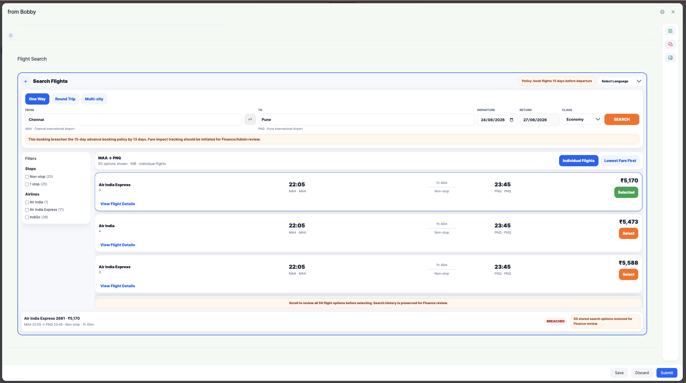
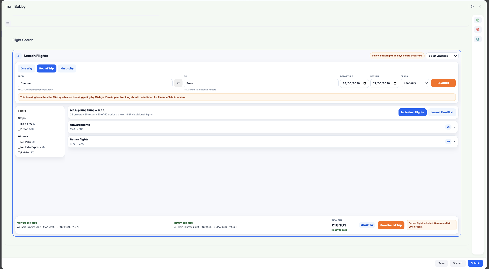
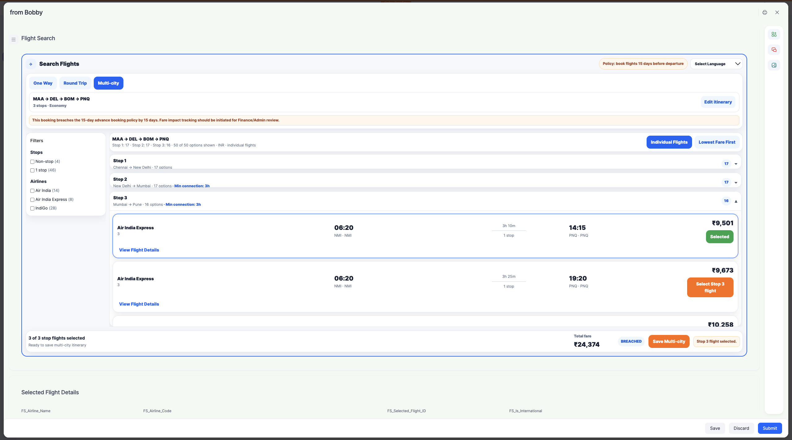
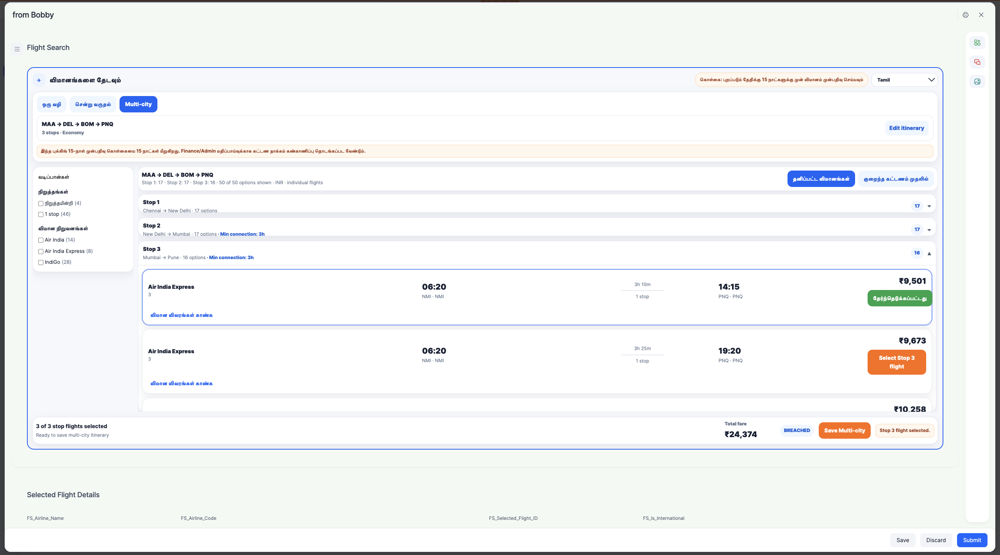
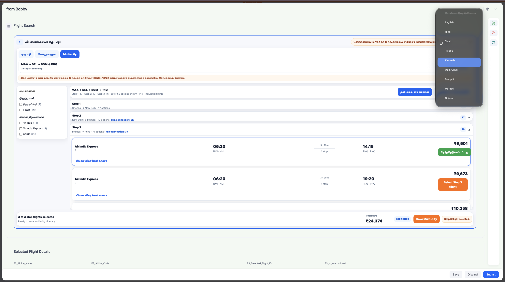

# Refex TMS Flight Search Form Component

A Kissflow custom form-field component for Refex Travel Management System.

The component supports:

- One-way flight search
- Round-trip flight search
- Multi-city flight search
- Multi-language UI labels
- Advance booking policy visibility
- Travolution-backed flight search through a secure Cloud Run API
- Multi-city selected flights capture into a Kissflow child table

## Screenshots

### One-way search



### Round-trip search



### Multi-city search



### Multilingual UI





## Architecture

```text
Kissflow Form Field
  -> Cloud Run Backend
  -> Travolution Auth API
  -> Travolution Air Search API
  -> Normalized Flight Response
  -> Kissflow Field JSON
  -> Kissflow onChange Mapping
  -> Parent Summary Fields + Multi-city Child Table
